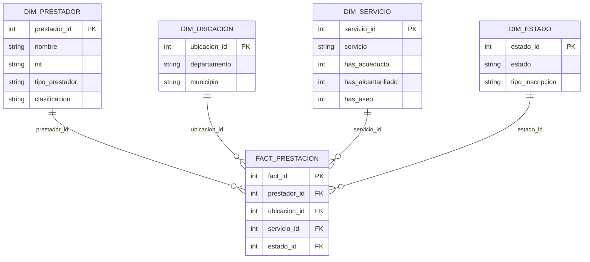
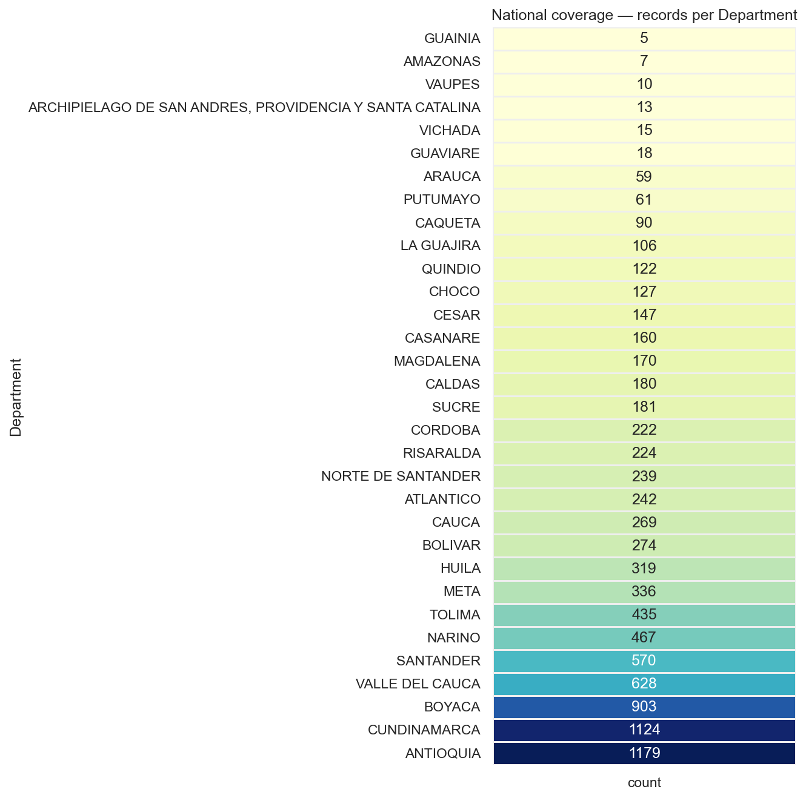
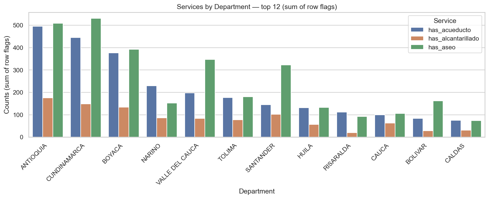

# 🚰 ETL Project — ODS 6 & RUPS Colombia 🇨🇴

This project applies an **ETL (Extract, Transform, Load)** process to analyze the **RUPS (Registro Único de Prestadores de Servicios Públicos)** dataset in Colombia, aligned with **Sustainable Development Goal 6 (SDG 6)**: *Ensure availability and sustainable management of water and sanitation for all*.

We analyze public service providers offering **water supply (acueducto)**, **sewerage (alcantarillado)**, and **solid waste (aseo)** services, focusing on **coverage, gaps, and environmental risks** across municipalities and departments.

---

## 📌 Overview

- ✅ **Source**: Open Government Dataset — RUPS (Superservicios Colombia)
- 🧹 **ETL Process**: Python (pandas) + SQLite + Seaborn
- 🧠 **Model**: Star Schema for dimensional analysis
- 📊 **Output**: KPIs, heatmaps, barplots, and service mix indicators
- 🌎 **Goal**: Support SDG 6 by identifying regions with poor service coverage or sanitary risks

---

## 🔁 ETL Architecture

### Extract — Transform — Load

| Step       | Description                                                                 |
|------------|-----------------------------------------------------------------------------|
| 🗃️ Extract  | Load raw CSV data with over 13,000 rows                                     |
| 🔧 Transform | Clean and enrich using regex and flags (`has_acueducto`, `has_aseo`, etc.) |
| 💾 Load     | Store final data in a SQLite DW with star schema                             |
| 📈 KPIs     | Generate indicators at municipal and departmental levels                    |
| 🖼️ Visuals   | Export images and CSV reports to support analysis and decision-making      |

---

## ⭐ Star Schema — Data Warehouse




The model follows a star schema design:

- **fact_prestacion**: Service delivery records
- **dim_prestador**: Provider info (name, NIT, classification)
- **dim_ubicacion**: Municipality and department
- **dim_servicio**: Type of service (AAA, acueducto, etc.)
- **dim_estado**: Operational status (active, cancelled, etc.)

---
## ETL FLOW


## 📊 Key KPIs (Summary Table)

| KPI No. | Indicator                                 | Description                                                                 | Output                                 |
|--------:|--------------------------------------------|-----------------------------------------------------------------------------|----------------------------------------|
| **1**   | General summary                             | Total rows, unique providers, coverage by department and municipality       | `kpi_summary.csv`                      |
| **2**   | National coverage (heatmaps)               | Top departments and bottom municipalities (AA coverage)                     | `kpi_coverage_heatmap_*.png`           |
| **3**   | Density: records per municipality          | Records normalized by number of municipalities                              | `kpi_density_records_per_municipality.png` |
| **4**   | Water vs. Sewerage (AA gap)                | Municipalities with water only, sewer only, or both                         | `kpi_water_vs_sewer_combo_summary.png` |
| **5**   | AA rate by department                      | % of municipalities with both water + sewerage                              | `kpi_aa_rate_by_department.png`        |
| **6**   | Services per department (top 12)           | Flags summed by department: acueducto, alcantarillado, aseo                 | `kpi_services_by_department_top12.png` |

---

## 📍 Sample Visuals

> You can find all graphs in the `images/` folder.

| Heatmap — Department Coverage | Barplot — Service Distribution |
|-------------------------------|-------------------------------|
|  |  |

---

## 💡 Insights & SDG 6 Implications

- Only **13.7%** of service units are **AAA** (provide all 3 services).
- **Some municipalities have acueducto but no alcantarillado**, posing a health/environmental risk.
- **Bogotá was excluded** from some KPIs to avoid skewed visualizations.
- Departments with **low AA rate (<50%)** should be **prioritized** for investment and planning.
- **Density KPIs** reveal structural gaps in service presence per municipality.

---

## 🗂️ Project Structure
```
├── data/ # Raw CSV file
├── etl/ # Scripts: extract.py, transform.py, load.py
├── database/ # rups.db (SQLite) and SQL model
├── notebooks/ # EDA & geospatial analysis
├── reports/ # CSV outputs with KPIs
├── images/ # PNG charts exported
├── requirements.txt # Required libraries
├── .gitignore
└── README.md

```


---

## ⚙️ How to Run

1. **Clone the repository**

```bash
git clone https://github.com/EstebanC111s/ETL-Project-First-Delivery.git
cd ETL-Project-First-Delivery
```

2. **Create and activate virtual environment**

```bash
python -m venv .venv
.venv\Scripts\activate
```
3. **Install dependencies**

```bash
pip install -r requirements.txt
```
4. **Run the pipeline**

```bash
python main.py

```

## 📤 Deployment Notes

This project is structured for academic reproducibility and public sector analytics. All KPIs, reports and charts are auto-generated. A georeferenced heatmap with Folium is included in notebooks/.

## 👥 Authors

| Member                  | Responsibilities                                                                                     |
|------------------------|-------------------------------------------------------------------------------------------------------|
| **Sara Lucía Rojas**   | Dataset justification, SDG 6 alignment, stack selection, final report writing ,README                      |
| **Carlos Andrés Orozco** | ETL: `extract.py`, `transform.py`, star schema design (ER diagram),README     |
| **Jose David Mesa**    | ETL: `load.py`, `main.py`, SQL model implementation, ETL architecture diagram  , geospatial visuals (`folium`),README                       |
| **Esteban Cobo**       | Exploratory Data Analysis (EDA), KPIs, README         |

---
